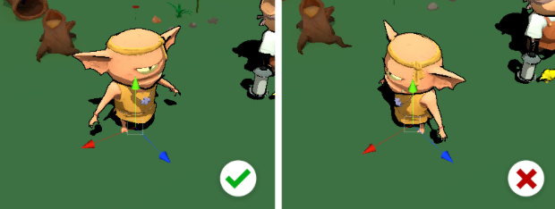

Du bist hier richtig, wenn Du Dich visuell am Projekt beteiligen möchtest, d.h. Du

* modellierst 3D-Modelle,
* erstellst 2D-Grafiken, -Icons,
* möchtest mit Shadern bzw. dem Shader-Graph visuellen Pepp hinzufügen (siehe auch [hier](../technical))

## Worauf muss ich achten?

### 3D

* Quasi Low Poly: Wir machen im Projekt nicht super harte Low Poly Umsetzung, aber eben auch kein High Poly. 
  Versuche Polys zu vermeiden, wo Du keine benötigst und nutze gerne dort ein paar mehr, wo es benötigt wird.
* Bitte achte darauf, dass alle Pivots korrekt gesetzt sind, gerade bei Dingen, die animiert werden sollen oder von Dir animiert wurden.
  Das Pivot vom Gesamtmodell soll unten in der Mitte des Modells sein.
* Orientierung an den Unity-Achsen:
  * X-Achse: nach rechts
  * Y-Achse: nach oben
  * Z-Achse: nach vorne
    
    Wenn Du die Achsenorientierung prüfen möchtest, geht das leider nur mit Unity. Hierzu kannst Du Dir irgendeine Unity-Version installieren, ein neues leeres Projekt erstellen, Deine `.fbx` Datei ins Projekt ziehen und dann in der Scene ablegen.
    
    
    
    (Originalbild vom Unity Open Game "Chop Chop")
* Skalierung: 1 Blender Unit = 1 Meter = 1 Unity Unit.
  Wenn wir Dein Modell in Unity importieren, muss es mit einem 1/1/1 Scaling bereits die korrekte Größe haben.
* Farben bzw. Farb-Palette muss sich im Laufe des Projektes noch finden.
* Benutze bitte keinerlei Texturen.
* Bitte beachte, dass die Shader Deiner Modellierungssoftware nicht mit Unity kompatibel sind. D.h. im Idealfall benötigt Dein Modell keinen eigenen Shader. Falls Du allerdings, Ausnahmen bestätigen die Regel, ein Modell/Aufgabe hast, die einen eigenen Shader benötigt, muss dieser Shader in Unity entwickelt werden. Du kannst ihn zwar in Deiner Modellierungssoftware auch erstellen, er dient dann allerdings nur als Referenz für die Unity-Shader-Entwicklung.
* Benenne Deine Meshes, Animationen etc. korrekt (und auf Englisch, dict.cc hilft beim Übersetzen), denn niemand weiß, was `Cube 1` und `Animation 3` nachher wirklich ist. 
* Einfache Modelle sollten aus nur einem Mesh bestehen.
* Exportiere Deine Modelle als `.fbx`.

### 2D

* Dein Bild sollte so klein wie möglich und so groß wie nötig sein.
* Farben bzw. Farb-Palette muss sich im Laufe des Projektes noch finden.
* Wenn Du Bilder für die Benutzeroberfläche erstellst, sollte dieses in der Regel ein sogenanntes "9-slicing Sprite" sein, siehe hierzu die [Dokumentation bei Unity](https://docs.unity3d.com/Manual/9SliceSprites.html). Es handelt sich hier um eine Standard-Technik, daher findest Du mit diesem Begriff einiges mehr über die Suchmaschine Deiner Wahl.
* Exportiere Deine Arbeit als `.png`.

## Wo lade ich meine Ergebnisse hin?

Du kannst Deine Ergebnisse im Ordner `_contributing/visual` ablegen.
Hier erstellst Du einen Ordner mit Deinem Benutzernamen und dort drin je nach Bedarf weitere Ordner (falls Du z.B. an mehrere Modellen gearbeitet hast). 

Wichtig ist, dass Du einmal die Original-Datei hochlädst (sodass jemand anders es weiterbearbeiten kann, falls es nötig ist) und Dein 3D-Modell als `.fbx` oder Deine 2D-Arbeit als `.png`. 

Bitte achte auch darauf, dass Deine Dateien bereits optimiert sind, unnötige Sachen entfernt sind, etc. 
Original-Dateien tendieren oft dazu, recht schnell groß zu werden.
Git und große Dateien sind nicht unbedingt Freunde, je mehr Du daher optimierst, umso besser.

Falls Du Dir unsicher bist, frag gerne auf dem [Discord]() nach.

### Beispiel

Wenn Dein Benutzername `DerMusterMensch` ist und Du ein Baum-Modell erstellt hast, dann würdest Du den Ordner `_contributing/visual/DerMusterMensch/Baum` anlegen und dort zwei Dateien hochladen:

* `Baum.blendfile`
* `Baum.fbx`

### Was passiert dann?

[Siehe hier](../#ich-habe-eine-aufgabe-fertig-was-mache-ich-damit).

### Hilfe, ich komme mit Git gar nicht klar

Als kreativer Mensch hat man oft noch keinen Berührungspunkt mit dem sehr technischen Git gehabt.
Spreche bitte einen [Ansprechpartner](https://github.com/boundfoxstudios/community-project/#ansprechpartner) an, eventuell kann er die Arbeit mit Git für Dich übernehmen.

_Für die Erweiterung Deiner Skills ist's natürlich cool, wenn Du Dir Git aneignest._
